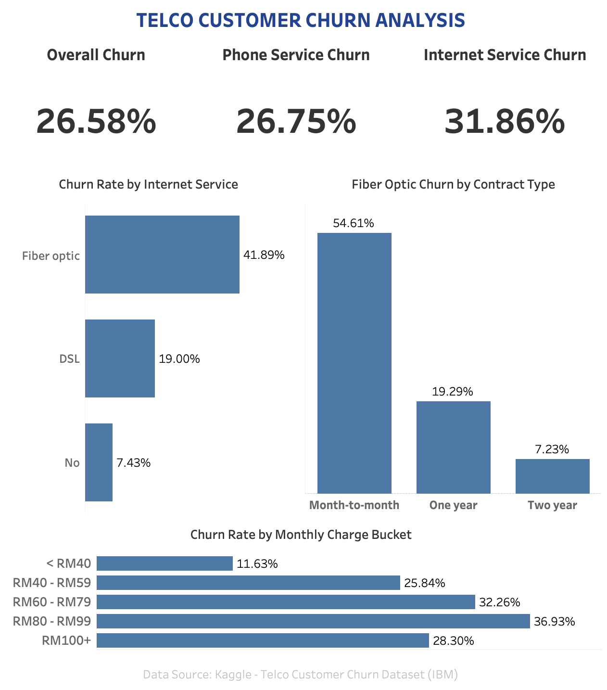

# Telco-Customer-Churn-Analysis
SQL and Tableau project analyzing customer churn patterns to identify key drivers and actionable retention insights.

## Executive Summary

This project analyzes customer churn within a telecommunications company using SQL for data exploration and Tableau for dashboard visualization.

The analysis focuses on identifying key churn patterns across internet service types, contract types and monthly charge segments to uncover potential drivers of customer attrition and support customer retention strategies.

## Business Problem

Telecommunication companies commonly monitor customer churn to better understand customer retention and identify customer segments with higher attrition.

Understanding where churn occurs can help businesses to prioritize further investigation and develop more targeted retention strategies.

## Objectives

Main questions explored in this project include:
* What is the overall customer churn rate?
* How does churn differ across phone and internet services?
* Which internet service has the highest churn rate?
* How does contract type influence churn among Fiber Optic customers?
* Is there a relationship between monthly charges and customer churn?

## Dataset

Source: [Kaggle - Telco Customer Churn Data](https://www.kaggle.com/datasets/blastchar/telco-customer-churn/data)

This dataset contains:
- Customer demographics
- Account information
- Contract details
- Monthly and total charges
- Customer churn status

## Tools and Technologies

- MySQL
- Tableau

## Data Preparation

Prior to analysis, the dataset was reviewed to ensure data quality and consistency.

Cleaning activities included:
- Checking for duplicate records
- Validating missing values
- Reviewing data types
- Standardizing column names
- Creating monthly charge buckets for analysis

## Exploratory Data Analysis (EDA)

### Overall Churn Overview
Calculated overall customer churn rate to establish a baseline for subsequent analysis.

**Insight:**
Approximately 26.58% of customers have churned, indicating that roughly one in four customers have discontinued the service.

### Internet Service Analysis
Compared churn rates across internet service types.

**Insight:**
Although Fiber Optic generally offers faster internet speeds than DSL, Fiber Optic customers exhibited the highest churn rate at 41.89%, compared with DSL at 19.00%.
This suggests that internet speed alone may not explain customer retention and that other factors such as contract type, pricing or customer expectations may also be associated with churn.

### Fiber Optic Contract Type Analysis
Focused analysis on Fiber Optic customers to understand whether contract type influences churn.

**Insight:**
Among Fiber Optic customers, the contract type of Month-to-month exhibited the highest churn rate (54.61%), while customers on one-year and two-year contracts experienced significantly lower churn.

## Monthly Charge Analysis
Customers were grouped into monthly charge ranges to examine how churn rates varied across pricing segments.
To interpret the result better, the distribution of internet service types within each pricing bucket was also examined.

**Insight:**
Customers paying between RM60-RM79 and RM80-RM99 showed the highest churn rates.
Further exploration showed that these pricing buckets were predominantly composed of Fiber Optic customers, suggesting that elevated churn may be associated with the concentration of Fiber Optic subscriptions within these price ranges rather than the monthly charges alone.

## Key Insights

Some of the key findings from the analysis include:
* Approximately one in four customers churned.
* Fiber Optic customers experienced substantially higher churn rate compared to DSL customers.
* Month-to-month contract type was associated with the highest churn rates among Fiber Optic customers.
* Customers paying RM60-RM99 monthly exhibited higher churn rates than lower priced customer segments.
* Longer contract commitments appear to be associaed with improved customer retention.

## Dashboard

The Tableau dashboard summarizes the key findings from the analysis, providing an interactive overview of customer churn across internet services, contract types and monthly charge segments.

## Business Recommendations

* Investigate customer satisfaction among Fiber Optic users to better understand drivers of churn.
* Encourage Month-to-month customers to transition to longer term contracts through retention campaigns or promotional offers.
* Review both pricing and service offerings for customers within the RM60-RM99 monthly charge segment.
* Monitor churn trends across high-risk customer groups  to support proactive retention initiatives.

## Limitations

* This analysis identifies associations, not causal relationships.
* The dataset does not specify the currency used for both MonthlyCharges and TotalCharges variables. For presentation purposes, monthly charge ranges were labeled using Malaysian Ringgit (RM) to improve readability.
* The dataset represents single point in time and does not include historical customer behaviour.
* Other factors that may influence the churn (e.g. service quality metrics) were not available.
* Findings are specific to this dataset and may not generalize to other telecommunications providers.

## Key Takeaways

Through this project, I strengthened my ability to:

* Explore business questions using SQL
* Perform customer segmentation through SQL queries
* Create business KPIs and churn metrics
* Build interactive dashboard using Tableau
* Translate analytical findings into actionable business insights
